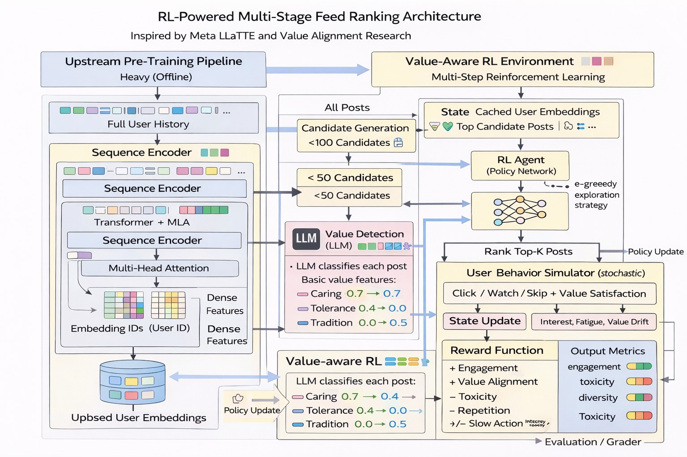

# 🚀 Value-Aware RL Feed Ranking Environment (OpenEnv)

## 📌 Overview
This project implements a **real-world reinforcement learning environment** for feed ranking systems. It simulates how modern recommendation systems balance **user engagement, diversity, and responsible AI objectives** such as value alignment and toxicity reduction.

The environment follows the **OpenEnv specification**, enabling agents to interact through standard APIs: `step()`, `reset()`, and `state()`.

---

## 🧠 Motivation
Real-world recommendation systems (e.g., social media feeds) face a fundamental challenge:

> Maximizing engagement while ensuring responsible and aligned content delivery.

This project models that trade-off using a **multi-objective reward system**, making it suitable for studying **alignment, fairness, and long-term user behavior** in AI systems.

---

## 🏗️ Architecture

This system models a **value-aware RL pipeline for feed ranking**:



### Key Components:
- **User State Representation** (embeddings, preferences, fatigue)
- **Candidate Post Selection**
- **Ranking Policy (Agent)**
- **User Behavior Simulator**
- **Reward Function (multi-objective)**
- **Evaluation / Grader System**

---

## ⚙️ Environment Design

### 🔹 Observation Space
The environment state is defined as:
UserState:

user_embedding (vector representation)
history (past interactions)
interest (engagement level)
fatigue (content saturation)
value preferences (alignment sensitivity)

---

### 🔹 Action Space
The agent selects:


Top-K ranked posts


Example:

[action] = [post_1, post_2, post_3]


---

### 🔹 Reward Function

The reward captures multiple objectives:

- ✅ Engagement (click / watch)
- ✅ Value Alignment
- ✅ Diversity
- ❌ Toxicity Penalty
- ❌ Fatigue Penalty

#### Hard Task Reward:

Reward = 0.5 * Engagement
+ 0.2 * Alignment
+ 0.1 * Diversity
- 0.2 * Toxicity
- 0.1 * Fatigue

## 🎯 Tasks

| Task | Objective |
|-----|----------|
| 🟢 Easy | Maximize engagement |
| 🟡 Medium | Engagement + Diversity |
| 🔴 Hard | Engagement + Alignment + Toxicity + Fatigue |

---

## 🧪 Evaluation

The environment includes an **agent grader** to evaluate performance across all tasks.

### Output Format (required for automated evaluation):

START
STEP task=easy score=...
STEP task=medium score=...
STEP task=hard score=...
END


---

## 📊 Key Insight

As task complexity increases from **Easy → Hard**, performance decreases.

> This demonstrates the real-world trade-off between **engagement optimization and responsible AI objectives**, a core challenge in modern recommendation systems.

---

## 🧰 Tech Stack

- Python
- NumPy
- Reinforcement Learning Concepts
- Simulation-based Evaluation

---

## 🚀 How to Run

### ▶️ Local Execution
```bash
python main.py

## 📚 References

This work draws inspiration from recent advances in reinforcement learning and value-aware ranking systems:

1. *Multi-Stage Feed Ranking Systems*  
   https://arxiv.org/pdf/1906.03109  

2. *Value-Aware Reinforcement Learning for Alignment*  
   https://arxiv.org/pdf/2601.20083  

3. *Sequential Optimization and Ranking in Dynamic Systems*  
   https://arxiv.org/pdf/2509.14434v1  